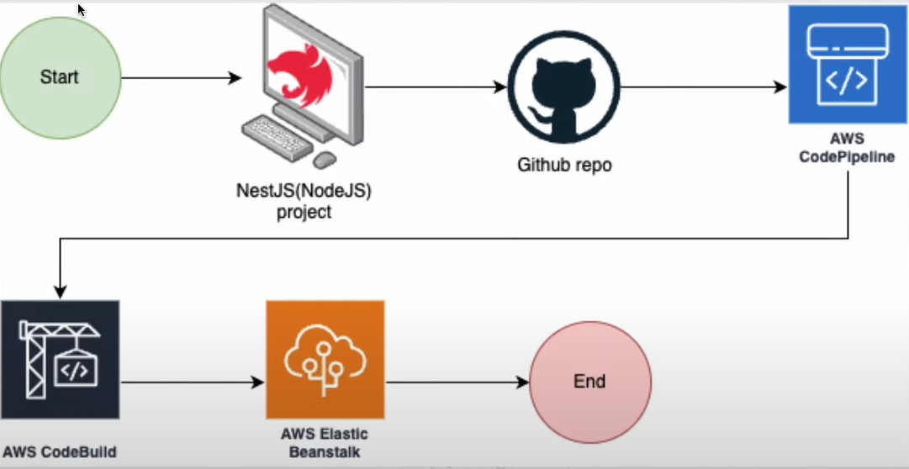

### Documentazione Tecnica del Progetto

#### Indice

1. Introduzione
2. Descrizione delle Entità
   - User
   - Technician
   - RequestsAction
3. Relazioni tra Entità
4. Chiamate API
   - User API
   - Technician API
   - RequestsAction API
5. Processo di Deploy Continuo

---

#### Introduzione

Questo documento descrive la struttura del database e le API di un sistema per la gestione delle richieste di intervento tecnico. Il sistema è sviluppato utilizzando il framework NestJS con TypeORM per la gestione delle entità e delle relazioni nel database. Il database è relazionale e configurato utilizzando Amazon RDS, un servizio fornito da AWS per la gestione dei database.

#### Descrizione delle Entità

**User**  
L'entità User rappresenta un utente del sistema. Ogni utente può fare molte richieste di intervento tecnico.

**Technician**  
L'entità Technician rappresenta un tecnico che può essere assegnato a varie richieste di intervento.

**RequestsAction**  
L'entità RequestsAction rappresenta una richiesta di intervento tecnico fatta da un utente.

#### Relazioni tra Entità

Le relazioni tra le entità sono definite come segue:

- Ogni utente (User) può fare molte richieste (RequestsAction), creando una relazione uno-a-molti tra User e RequestsAction.
- Ogni richiesta (RequestsAction) è associata a un solo utente, creando una relazione molti-a-uno tra RequestsAction e User.

#### Chiamate API

**User API**

- `POST /api/user/create`: Crea un nuovo utente.
- `GET /api/user/findAll`: Restituisce una lista di tutti gli utenti.
- `GET /api/user/:id`: Restituisce i dettagli di un utente specifico.
- `PATCH /api/user/:id`: Aggiorna i dettagli di un utente specifico.
- `DELETE /api/user/:id`: Elimina un utente specifico.
- `POST /api/user/login`: Effettua il login di un utente.
- `POST /api/user/req-reset`: Richiede il reset della password.
- `POST /api/user/reset-password`: Resetta la password di un utente.
- `POST /api/user/refresh`: Effettua il refresh del token di autenticazione.
- `POST /api/user/verifyEmailCode`: Verifica il codice email di un utente.
- `PATCH /api/user/changePassword`: Cambia la password di un utente.

**Technician API**

- `POST /api/technicians/create`: Crea un nuovo tecnico.
- `GET /api/technicians/find`: Restituisce una lista di tutti i tecnici.
- `GET /api/technicians/:id`: Restituisce i dettagli di un tecnico specifico.

**RequestsAction API**

- `POST /api/requests-action/create`: Crea una nuova richiesta di intervento.
- `GET /api/requests-action/find`: Restituisce una lista di tutte le richieste di intervento.
- `GET /api/requests-action/:id`: Restituisce i dettagli di una richiesta di intervento specifica.
- `DELETE /api/requests-action/:id`: Elimina una richiesta di intervento specifica.

#### Processo di Deploy Continuo

L'immagine seguente illustra il flusso di deploy continuo per un'applicazione NestJS utilizzando servizi AWS e GitHub. Ecco una descrizione dettagliata di ogni fase del processo:

**Inizio (Start)**  
Il processo inizia con lo sviluppo di un progetto NestJS (Node.js). NestJS è un framework per costruire applicazioni server-side efficienti e scalabili utilizzando TypeScript.

**Repository GitHub**  
Una volta sviluppato, il codice del progetto NestJS viene caricato su un repository GitHub. GitHub serve come sistema di controllo delle versioni, permettendo di gestire il codice sorgente e collaborare con altri sviluppatori.

**AWS CodePipeline**  
AWS CodePipeline è un servizio di integrazione e consegna continua che automatizza i passaggi necessari per il deploy delle applicazioni. Ogni volta che c'è una modifica nel repository GitHub (ad esempio un push), CodePipeline avvia il processo di build e deploy. CodePipeline è configurato per monitorare il repository GitHub e avviare automaticamente la pipeline quando vengono rilevati nuovi commit o modifiche.

**AWS CodeBuild**  
AWS CodeBuild è un servizio di integrazione continua che compila il codice sorgente, esegue i test e produce pacchetti software pronti per il deploy. CodeBuild recupera il codice dal repository GitHub, lo compila e lo testa, assicurandosi che sia privo di errori e pronto per l'uso in produzione.

**AWS Elastic Beanstalk**  
AWS Elastic Beanstalk è un servizio di gestione delle applicazioni che facilita il deploy e il ridimensionamento delle applicazioni web e dei servizi sviluppati con diversi linguaggi e piattaforme. Dopo che il codice è stato costruito e testato da CodeBuild, Elastic Beanstalk prende il pacchetto pronto e lo distribuisce su un ambiente preconfigurato. Elastic Beanstalk gestisce automaticamente il provisioning della capacità, il bilanciamento del carico, il monitoraggio delle prestazioni e l'applicazione delle patch.

**Fine (End)**  
Il processo di deploy si conclude con il codice dell'applicazione in esecuzione su AWS Elastic Beanstalk, pronto per essere utilizzato dagli utenti finali.

---

### Conclusione

In questa documentazione ho fornito una panoramica del sistema di gestione delle richieste di intervento tecnico, sviluppato utilizzando NestJS e TypeORM. Ho descritto le entità principali del sistema - User, Technician, e RequestsAction - e le loro relazioni, illustrando come interagiscono tra loro nel database relazionale configurato su Amazon RDS. Ho anche delineato le chiamate API necessarie per gestire le entità, comprese le operazioni di creazione, lettura, aggiornamento e cancellazione (CRUD).

Inoltre, ho dettagliato il processo di deploy continuo, che sfrutta servizi AWS come CodePipeline, CodeBuild e Elastic Beanstalk per garantire che ogni aggiornamento del codice sia automaticamente testato e distribuito, assicurando così un'integrazione e distribuzione continua e affidabile.

Questa documentazione funge da guida per comprendere l'architettura del sistema, le API disponibili e il flusso di lavoro del deploy continuo, facilitando il contributo degli sviluppatori al progetto e mantenendo il sistema robusto e scalabile.

docker run -p 3000:3000 home-fix-api
